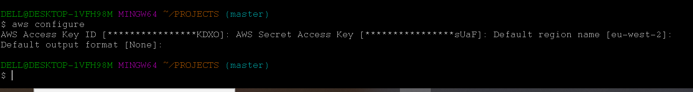
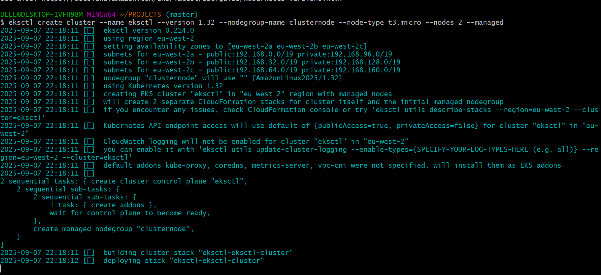
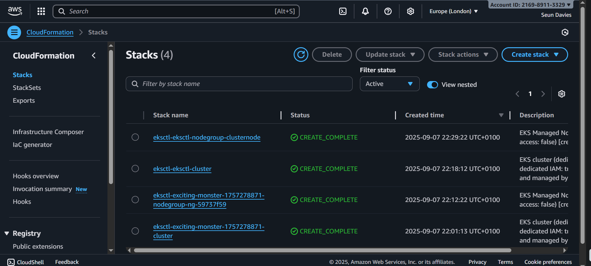

# Managing-Amazon-Elastic-Kubernetes-Service-with-eksctl
A demonstration of how I established a Kubernetes cluster using eksctl and managed the microservices with Helm. 


# aws-eksctl-with-helm

# Contents
* [Architecture](#architecture)
* [Project Objective](#project-Objective)
* [Pre-requisites](#pre-requisities)
  * [Knowledge](#knowledge)
  * [Tools](#tools)
* [Demo](#demo)
  * [Provision cluster with eskctl](#provision-cluster-with-eskctl)
    * [Configure kubectl to communicate with cluster](#configure-kubectl-to-communicate-with-cluster)
    * [Configure auto-scaling](#configure-auto-scaling)
  * [Deploy Microservices with helmfile](#deploy-microservices-with-helmfile)
    * [Create helm chart](#create-helm-chart)
    * [Deploy services to cluster](#deploy-services-to-cluster)
* [Resources](#resources)

## Architecture


## Project Objective
By the end of each part of this project, we will know how to;
- provision scalable managed kubernetes(eks) cluster resources in AWS with the help of eksctl.
- deploy highly performant microservices applications with helmfile.

## Pre-requisities
- So that we all be on the same page, it will be nice to have following in our tool belt;
### Knowledge
- Basic knowledge of how AWS, kubernetes, helm, yaml, prometheus and grafana works.
### Tools
- [aws](https://aws.amazon.com/) - cloud platform, offers reliable, scalable, and inexpensive cloud computing services.
- [aws cli](https://docs.aws.amazon.com/cli/latest/userguide/getting-started-install.html)  - a unified tool to manage your AWS services.
- [VSCode](https://code.visualstudio.com/) - a source-code editor made by Microsoft with the Electron Framework, for Windows, Linux and macOS.
- [helm](https://helm.sh/) - Helm helps you manage Kubernetes applications — Helm Charts help you define, install, and upgrade even the most complex Kubernetes application.
- [eksctl](https://eksctl.io/) - a simple CLI tool for creating and managing clusters on EKS - Amazon's managed Kubernetes service for EC2.

## Demo
From the architecture flow shown;
Git --> GitHub --> eskctl --> helmfile --> kubernetes cluster --> prometheus --> Grafana


### Provision cluster with eskctl
- Step 1: Programmatic access; 

- Step 2: Install and configure kubectl, AWS CLI and eksctl. [Link to How](https://docs.aws.amazon.com/eks/latest/userguide/getting-started.html). Be careful to set and utilise profile name when working with multiple accounts in your machine.
- Step 3: Creating cluster with (1.) a name (2.) version 1.22 (3.) nodegroup name, type and number in a specify region. Run the command; 
```
eksctl create cluster --name eksctl --version 1.22 --nodegroup-name clusternode --node-type t3.micro --nodes 2 --managed
```

- Step 4; Check Cloudformation and eks from aws management console


With this command, we have successfuly create a eks cluster with 2 nodegroup.

#### Configure kubectl to communicate with cluster
- Step 1; Configure your computer to communicate with your cluster. Run the command;
```
aws eks update-kubeconfig --region us-east-1 --name ecommerce
```

- Step 2; Confirm your context and test your configuration. Run these commands first to list your contexts and check your configuration
```
kubectl config get-contexts
```
```
kubectl get svc
```


### Deploy Microservices with helmfile
Let’s quickly remind ourselves that;
- The microservices source code repository for this project is from this link; [google-microservices-demo](https://github.com/GoogleCloudPlatform/microservices-demo), containing 11 services I will be deploying with this demo. Among the services, Frontend serve as entrypoint for all the service receiving externally request from the browser. The load generator deployment is optional.
- Also, image names for each microservice, expected environment variables including which port each starts and decision on namespace depending on developer's access must be a collaborative effort between Dev and Ops team.
Before moving on with the following steps, get helm installed [helm](https://helm.sh/docs/intro/install/)
- The exact file structure;


#### Create helm chart
- Step 1: Create shared helm chart for the 10 microservices by running this command;
```
helm create common
```
It should auto generate a folder named after what we call our chart, containing; charts folder, template folder, Chart.yaml, values.yaml, .helmignore file.
Optionally, if so desire to deploy with kubernetes declaratively, create a config.yaml, that contains defination for deployment and service for all the microservices. 
- Step 2: Inside template folder create deployment and service blueprint by configuring the ``deployment.yaml`` and ``service.yaml``
- Step 3: Set the -range built-in function for working with lists of environment variables; mostly use in the env attribute and also observe quote built-in function for working with string value.
- Step 4: In the ``values.yaml`` file where we define the variable name in flat structure, set the default values for the template files.
- Step 5; Create chart for redis. Similar processes to how we create common chart. cd into the charts folder, then run;
```
helm create redis
```
- Step 6; Create a folder named values at the root of project directory, that will contain config files for all microservice which will override the default value in the ``values.yaml``

#### Deploy services to cluster
- Step 1; To preview if the config files for each service defined are correct before actual deployment, run this command for each service file;
```
helm template -f <path/to/file> <path/to/chart>
```

- Step 2; Individually check if microservices successfully deploy microservices to the cluster. 
```
helm install -f <file-name> <releases-name> <chart-name>
```
- Step 3; To list the deployed microsservices with this command;
```
helm ls
```
or 
```
kubectl get pod
```
- Step 4; Install helmfile tool, for macOS user;
```
brew install helmfile
```

- Step 5; Create and configure a helmfile - ``helmfile.yaml``
- Step 6; Declare the manifest into the cluster;
```
helmfile sync
```


- Step 7; To destroy;
```
helm destroy
```

## Resources
The following are useful resources that really contribute to actualise this project;
- Docs; aws doc, helm doc, eksctl doc
- YouTube Channels; TechWorldWithNana, Cloud With Raj, Be A Better Dev, DevOps Made Easy
- Repo; 
- 
